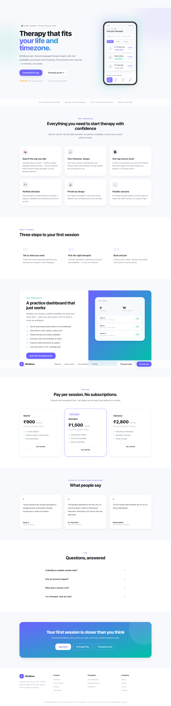
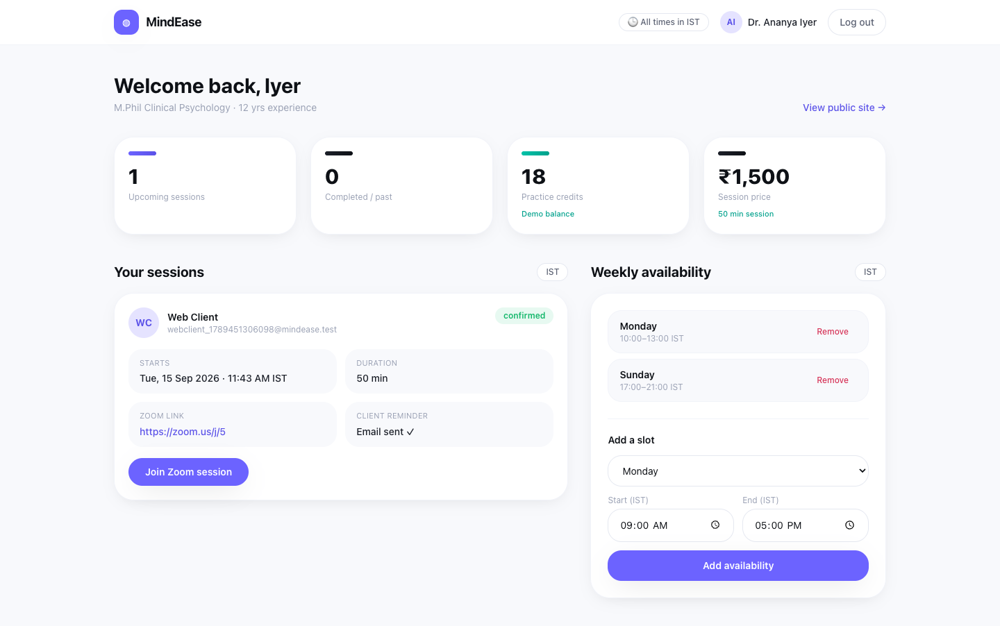
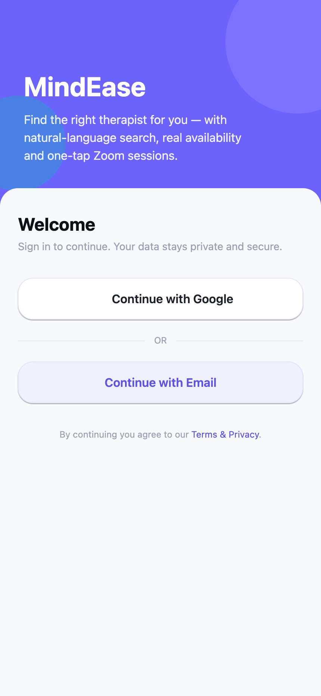
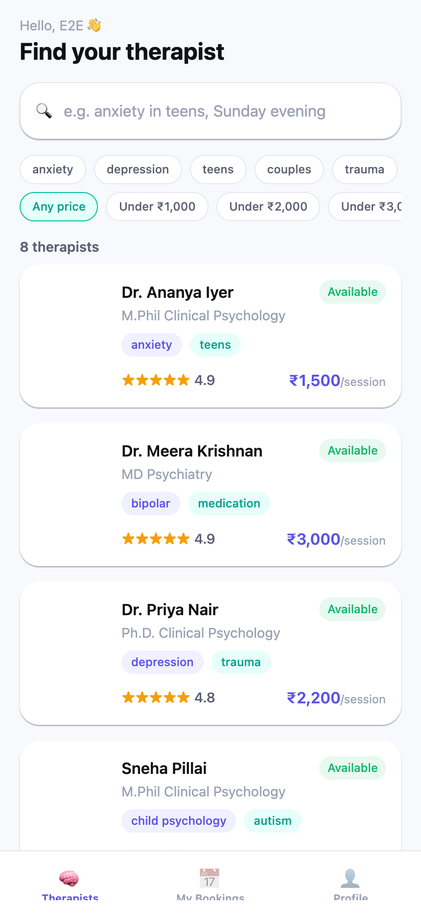
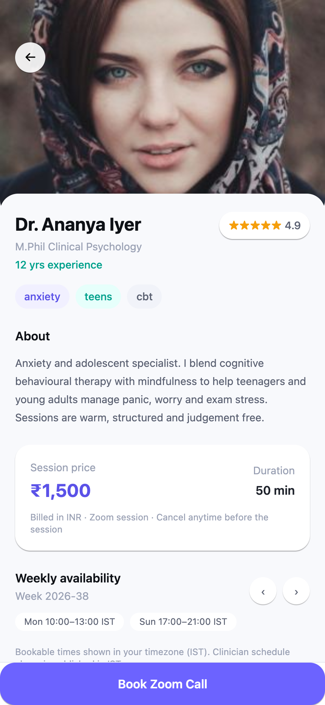
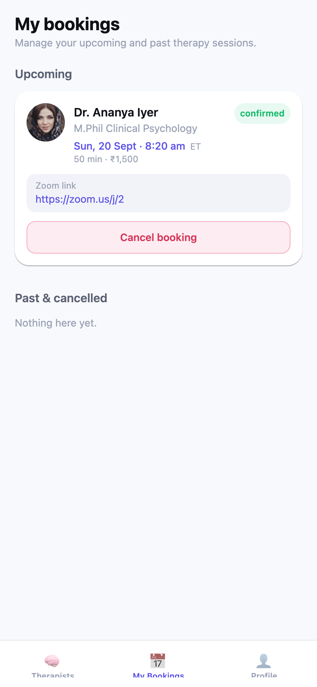

# MindEase — Therapist Finder & Practice Platform

A production-ready therapist discovery, booking and practice-management product.

- **Mobile app** — React Native (Expo SDK 57) + TypeScript + NativeWind + `expo-router`, React Query, Zustand
- **Marketing website + therapist portal** — React (Vite) + TypeScript + Tailwind CSS + React Router
- **Backend** — Django 5.2 + Django REST Framework + SimpleJWT + PostgreSQL/`pgvector` (SQLite for dev) + `sentence-transformers`
- **Auth** — Google Sign-In **and** email + password for clients; email + password for therapists
- **Sessions** — a Zoom link is created per booking and **emailed 30 minutes before the session**
- **Timezones** — clients see times in their own timezone; clinicians and the backend always use IST
- **Payments** — intentionally **not implemented**; one empty hook inside `book_session()` marks where it will live

<p align="center">
  
  
</p>
<p align="center">
  
  
  
  
</p>

## Repository layout

```
backend/        Django project, apps, migrations, fixtures, tests, README
mobile/         Expo React Native client app (app/, src/, __tests__/)
web/            React marketing website + therapist portal (Vite)
e2e/            Real-browser end-to-end verification (Playwright) + screenshots
.env.example    All required environment variables
```

## Prerequisites

- Python 3.11+ (tested on 3.14)
- Node.js 20.19+ (Expo SDK 57 requires ≥ 22.13)
- (Production only) PostgreSQL with the `pgvector` extension
- Google Chrome (only for the optional E2E runs)

---

## 1. Backend

```sh
cd backend
python3 -m venv .venv && source .venv/bin/activate
pip install -r requirements.txt

cp ../.env.example .env          # optional — defaults run on SQLite out of the box
python manage.py migrate
python manage.py seed_therapists # 8 therapists (demo password TherapistPass123) + availability
python manage.py runserver 0.0.0.0:8000
```

Health check: `curl http://localhost:8000/api/health/`

> **Embeddings** — `all-MiniLM-L6-v2` is downloaded on first use (~90 MB) and cached.
> `seed_therapists` encodes each therapist automatically. If the model cannot be loaded,
> search degrades to keyword/full-text search — nothing crashes.

Run the backend test suite (SQLite in-memory):

```sh
python manage.py test
```

### Session reminder emails

A booking's Zoom link is emailed to the client 30 minutes before the session. The
job is idempotent and safe to run every minute:

```sh
python manage.py send_session_reminders            # one pass
python manage.py send_session_reminders --loop     # poll every 60s
```

Recommended cron entry:

```cron
* * * * * cd /srv/mindease/backend && .venv/bin/python manage.py send_session_reminders
```

Configure delivery via `EMAIL_BACKEND` (console in dev, file-based for E2E, SMTP in production).

---

## 2. Mobile app (clients)

```sh
cd mobile
npm install

export EXPO_PUBLIC_API_URL=http://localhost:8000/api
npx expo start --web --port 8081     # or: npx expo start  (iOS/Android)
```

Open http://localhost:8081. Tests: `npm test -- --ci` and `npx tsc --noEmit`.

---

## 3. Website (sales pitch + therapist portal)

```sh
cd web
npm install
npm run dev          # http://localhost:5173
```

- `/` — the marketing site (hero, features, how-it-works, therapist section, pricing, testimonials, FAQ).
- `/portal/login` — therapist sign-in.
- `/portal` — the therapist practice dashboard.

### Therapist portal

Seeded clinicians can sign in with their email and the demo password
(`TherapistPass123`, configurable via `SEED_THERAPIST_PASSWORD`), e.g.
`ananya.iyer@mindease.test`.

The dashboard provides:

- **Sessions** — upcoming and past bookings with the client's name and email.
- **Zoom links** — ready-to-join link for every session, plus the reminder status.
- **Practice credits** — a demo/filler balance (not tied to payments).
- **Weekly availability** — add and remove recurring IST slots.
- **IST everywhere** — all clinician-facing times are rendered in IST.

---

## 4. Timezones

MindEase is an international product that targets India for regulatory reasons:
onboarding only offers **India** as a country, but a client can be anywhere and
sees every time in their own zone.

| Surface | Timezone |
|---|---|
| Client app (list, detail, confirm, bookings) | the client's `preferred_timezone` (selectable in Profile, default `Asia/Kolkata`) |
| Therapist portal | always **IST** (`Asia/Kolkata`) |
| Backend storage & admin | **IST** (`TIME_ZONE = "Asia/Kolkata"`) |

Clients pick their zone in **Profile → Time zone**; the choice is persisted to
`UserProfile.preferred_timezone` and applied to every slot and booking they see.
The mobile E2E switches the zone from IST to US Eastern and asserts the booking
time is re-rendered accordingly.

---

## 5. Google OAuth setup

Google Sign-In works on both the backend (ID-token verification) and the mobile
client (browser-based OAuth via `expo-auth-session`).

1. Create a project in the [Google Cloud Console](https://console.cloud.google.com/).
2. **APIs & Services → OAuth consent screen** — configure it and add your test users.
3. **APIs & Services → Credentials → Create credentials → OAuth client ID**:
   - **Web application** → used by the backend and Expo web. Add redirect URIs such as
     `http://localhost:8081`, `http://localhost:8081/oauth`, `https://auth.expo.io/@you/mindease`.
   - (Optional) **iOS** / **Android** clients for native builds.
4. Copy the **Web client ID** into both places (they must match):
   - Backend `GOOGLE_CLIENT_ID` (verifies the ID token audience)
   - Mobile `EXPO_PUBLIC_GOOGLE_CLIENT_ID` (builds the authorization request)
5. Set `GOOGLE_CLIENT_SECRET` on the backend.

The mobile client sends the Google **ID token** to `POST /api/auth/google/`; the
backend verifies it with `google-auth`, get-or-creates the user by verified email
and returns a JWT pair.

### CI / headless Google testing

Set `EXPO_PUBLIC_GOOGLE_DEV_TOKEN=<any-token>` so the "Continue with Google"
button still performs the real call to `/api/auth/google/` without a consent
screen. The backend rejects the fake token like any other invalid token.
**Never set this in production.**

---

## 6. Environment variables

See [`.env.example`](.env.example) for the full annotated list.

| Variable | Used by | Purpose |
|---|---|---|
| `SECRET_KEY` | backend | Django secret |
| `DEBUG` / `ALLOWED_HOSTS` | backend | Debug + host allowlist |
| `DATABASE_URL` | backend | PostgreSQL URL; blank ⇒ SQLite |
| `JWT_SIGNING_KEY` | backend | SimpleJWT signing key |
| `JWT_ACCESS_MINUTES` / `JWT_REFRESH_DAYS` | backend | Token lifetimes |
| `SEED_THERAPIST_PASSWORD` | backend | Demo password for seeded clinicians |
| `SESSION_REMINDER_MINUTES` | backend | Reminder lead time (default 30) |
| `EMAIL_BACKEND` / `EMAIL_FILE_PATH` / `DEFAULT_FROM_EMAIL` | backend | Reminder email delivery |
| `GOOGLE_CLIENT_ID` / `GOOGLE_CLIENT_SECRET` | backend | Google ID-token verification |
| `EXPO_PUBLIC_GOOGLE_CLIENT_ID` / `EXPO_PUBLIC_GOOGLE_DEV_TOKEN` | mobile | Google auth request / CI bypass |
| `EXPO_PUBLIC_API_URL` | mobile | API base URL |
| `VITE_API_URL` | web | API base URL |
| `ZOOM_SDK_KEY` / `ZOOM_SDK_SECRET` | backend | Zoom (placeholder) |
| `EMBEDDING_MODEL_NAME` | backend | Sentence-transformers model |

---

## 7. End-to-end verification

Two real-Chromium (headless) Playwright harnesses capture screenshots:

```sh
# terminal 1: backend (seeded, file-based email capture)
cd backend && EMAIL_BACKEND=django.core.mail.backends.filebased.EmailBackend \
  EMAIL_FILE_PATH="$PWD/emails" python manage.py runserver 0.0.0.0:8000

# terminal 2: expo web
cd mobile && EXPO_PUBLIC_API_URL=http://localhost:8000/api \
  EXPO_PUBLIC_GOOGLE_DEV_TOKEN=mock-google-id-token npx expo start --web --port 8081

# terminal 3: website
cd web && npm run dev

# terminal 4: run the harnesses
cd e2e && npm install
node run.mjs      # mobile app: 33 steps
node web.mjs      # website + portal + reminder email: 25 steps
```

`run.mjs` covers: redirect-to-auth, both auth buttons, email sign-up, onboarding,
therapist list, **date availability filters (Tomorrow / This weekend, and clearing
them)**, natural-language search, detail, booking a free slot, the slot turning grey
on re-open, persistence across reload, **switching the timezone from IST to US
Eastern and re-rendering the booking**, logout and the Google verification request.

`web.mjs` covers: the landing page sections, a booking created ~25 minutes out,
the **30-minute reminder email actually being written and containing the Zoom
link**, portal login, dashboard credits/sessions/Zoom links in IST, the
availability editor (add, invalid range, remove), logout and rejection of a
non-therapist account.

Both assert **zero console errors / page errors**. Screenshots land in `e2e/screenshots/`.

---

## Feature notes & constraints

- **Payments** are deliberately absent. The only integration point is the empty,
  clearly-commented block in `backend/bookings/services.py::book_session()`.
- **Onboarding location** exposes **India only**; the other regions are not rendered at all.
- **Onboarding language** enables **English only**; Hindi/Tamil appear disabled as scaffolding.
- **Vector search** uses `pgvector` `<=>` cosine distance on PostgreSQL and a Python
  cosine fallback elsewhere; without embeddings it falls back to keyword/full-text
  search. Parsed time expressions ("Sunday evening") are applied as an availability
  filter when they leave at least one candidate.
- **Auth** supports Google Sign-In and email + password simultaneously. Attempting an
  email/password login for a Google-only account returns `Account uses Google sign-in.`
- **Design tokens** are shared between the app (`mobile/tailwind.config.js`) and the
  website (`web/tailwind.config.js`): primary `#6C63FF`, accent `#00C2A8`, danger
  `#EF476F`, radii `xl2` = 20px, `xl3` = 28px.

## Test summary

| Suite | Command | Result |
|---|---|---|
| Backend (42 tests) | `python manage.py test` | 42 passed |
| Mobile (32 tests) | `npm test -- --ci` | 32 passed |
| Mobile E2E (36 steps) | `node e2e/run.mjs` | 36 passed, 0 console errors |
| Website E2E (25 steps) | `node e2e/web.mjs` | 25 passed, 0 console errors |

See [`TEST_REPORT.md`](TEST_REPORT.md) for the detailed run output.
